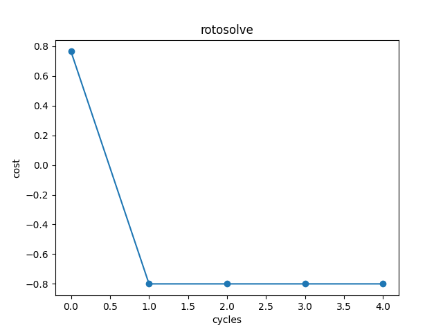

经典神经网络模块
==================================

以下的经典神经网络模块均支持自动反向传播计算。当您运行前传函数以后，再执行反向函数就可以计算梯度。一个卷积层的简单例子如下：

.. code-block::

    from pyvqnet.tensor import QTensor
    from pyvqnet.nn import Conv2D
    from pyvqnet._core import Tensor as CoreTensor
    # an image feed into two dimension convolution layer
    b = 2        # batch size 
    ic = 2       # input channels
    oc = 2      # output channels
    hw = 4      # input width and heights

    # two dimension convolution layer
    test_conv = Conv2D(ic,oc,(3,3),(2,2),"same")

    # input of shape [b,ic,hw,hw]
    x0 = QTensor(CoreTensor.range(1,b*ic*hw*hw).reshape([b,ic,hw,hw]),requires_grad=True)

    #forward function
    x = test_conv(x0)

    #backward function with autograd
    x.backward()
    print(x0.grad)

    # [
    # [[[0.1421299130, -0.3142514527, 0.1421299130, -0.2090271264],
    #  [-0.1344639957, -0.2651308477, -0.1344639957, 0.2657127380],
    #  [0.1421299130, -0.3142514527, 0.1421299130, -0.2090271264],
    #  [-0.0886643603, -0.1953052282, -0.0886643603, 0.1326911747]],
    # [[0.0469159335, -0.1304148436, 0.0469159335, -0.0187919736],
    #  [0.0170615539, 0.2544430196, 0.0170615539, -0.0038446635],
    #  [0.0469159335, -0.1304148436, 0.0469159335, -0.0187919736],
    #  [0.0726733357, -0.1026784033, 0.0726733357, -0.2304982394]]],
    # [[[0.1421299130, -0.3142514527, 0.1421299130, -0.2090271264],
    #  [-0.1344639957, -0.2651308477, -0.1344639957, 0.2657127380],
    #  [0.1421299130, -0.3142514527, 0.1421299130, -0.2090271264],
    #  [-0.0886643603, -0.1953052282, -0.0886643603, 0.1326911747]],
    # [[0.0469159335, -0.1304148436, 0.0469159335, -0.0187919736],
    #  [0.0170615539, 0.2544430196, 0.0170615539, -0.0038446635],
    #  [0.0469159335, -0.1304148436, 0.0469159335, -0.0187919736],
    #  [0.0726733357, -0.1026784033, 0.0726733357, -0.2304982394]]]
    # ]

.. currentmodule:: pyvqnet.nn

Module类
-------------------------------

abstract calculation module

Module
^^^^^^^^^^^^^^^^^^^^^^^^^^^^^

.. py:class:: pyvqnet.nn.module.Module

    Base class for all neural network modules including quantum modules or classic modules.
    Your models should also be subclass of this class for autograd calculation.

    Modules can also contain other Modules, allowing to nest them in
    a tree structure. You can assign the submodules as regular attributes::

        class Model(Module):
            def __init__(self):
                super(Model, self).__init__()
                self.conv1 = pyvqnet.nn.Conv2d(1, 20, (5,5))
                self.conv2 = pyvqnet.nn.Conv2d(20, 20, (5,5))

            def forward(self, x):
                x = pyvqnet.nn.activation.relu(self.conv1(x))
                return pyvqnet.nn.activation.relu(self.conv2(x))

    Submodules assigned in this way will be registered

forward
^^^^^^^^^^^^^^^^^^^^^^^^^^^^^

.. py:function:: pyvqnet.nn.module.Module.forward(x, param_keys=None, circuits=None, func=None)

    Abstract method which performs forward pass.

    :param x: input QTensor
    :param param_keys: specific param keys for QNLP algorithm,default None.
    :param circuits: specific circuits from other code for QNLP algorithm,default None.
    :param func: specific convert function to qpanda circuits for QNLP algorithm,default None.
    :return: module output

    Example::

        import numpy as np
        from pyvqnet.tensor import QTensor
        from pyvqnet.nn import Conv2D
        b= 2
        ic = 3
        oc = 2
        test_conv = Conv2D(ic,oc,(3,3),(2,2),"same")
        x0 = QTensor(np.arange(1,b*ic*5*5+1).reshape([b,ic,5,5]),requires_grad=True)
        x = test_conv.forward(x0)
        # [
        # [[[-5.2864003181, -2.0396244526, -1.0392782688],
        # [8.1300973892, 19.1137886047, 14.9272727966],
        # [25.7521533966, 38.2263565063, 21.3133182526]],
        # [[-6.8773040771, -5.7524614334, 5.4245557785],
        # [-10.7822828293, -14.3696794510, 8.2572793961],
        # [-22.1924304962, -10.1959953308, 20.8503952026]]],
        # [[[12.9491271973, 12.2721614838, 5.7445521355],
        # [42.0022010803, 65.2489242554, 52.9408111572],
        # [64.9610290527, 96.2482986450, 56.7728919983]],
        # [[-12.8945121765, 11.4664468765, 51.2426567078],
        # [-28.7769222260, -20.1474494934, 44.5306663513],
        # [-57.5836906433, -22.4221553802, 53.3052864075]]]
        # ]

        
state_dict 
^^^^^^^^^^^^^^^^^^^^^^^^^^^^^

.. py:function:: pyvqnet.nn.module.Module.state_dict(destination=None, prefix='')

    Returns a dictionary containing a whole state of the module.

    Both parameters and persistent buffers (e.g. running averages) are
    included. Keys are corresponding parameter and buffer names.

    :param destination: a dict where state will be stored
    :param prefix: the prefix for parameters and buffers used in this
        module

    :return: a dictionary containing a whole state of the module

    Example::

        from pyvqnet.nn import Conv2D
        test_conv = Conv2D(2,3,(3,3),(2,2),"same")
        print(test_conv.state_dict().keys())
        #odict_keys(['weights', 'bias'])

save_parameters
^^^^^^^^^^^^^^^^^^^^^^^^^^^^^

.. py:function:: pyvqnet.utils.storage.save_parameters(obj, f)

    Saves model parmeters to a disk file.

    :param obj: saved OrderedDict from state_dict()
    :param f: a string or os.PathLike object containing a file name
    :return: None

    Example::

        from pyvqnet.nn import Module,Conv2D
        import pyvqnet
        class Net(Module):
            def __init__(self):
                super(Net, self).__init__()
                self.conv1 = Conv2D(input_channels=1, output_channels=6, kernel_size=(5, 5), stride=(1, 1), padding="valid")

            def forward(self, x):
                return super().forward(x)

        model = Net() 
        pyvqnet.utils.storage.save_parameters(model.state_dict(),"tmp.model")

load_parameters
^^^^^^^^^^^^^^^^^^^^^^^^^^^^^

.. py:function:: pyvqnet.utils.storage.load_parameters(f)

    Loads model paramters from a disk file.

    The model instance should be created first.

    :param f: a string or os.PathLike object containing a file name
    :return: saved OrderedDict for ``load_state_dict()``

    Example::

        from pyvqnet.nn import Module,Conv2D
        import pyvqnet

        class Net(Module):
            def __init__(self):
                super(Net, self).__init__()
                self.conv1 = Conv2D(input_channels=1, output_channels=6, kernel_size=(5, 5), stride=(1, 1), padding="valid")

            def forward(self, x):
                return super().forward(x)

        model = Net()   
        model1 = Net()  # another Module object
        pyvqnet.utils.save_parameters( model.state_dict(),"tmp.model")
        model_para =  pyvqnet.utils.storage.load_parameters("tmp.model")
        model1.load_state_dict(model_para)

经典神经网络层
-------------------------------

Conv1D
^^^^^^^^^^^^^^^^^^^^^^^^^^^^^

.. py:class:: pyvqnet.nn.Conv1D(input_channels:int,output_channels:int,kernel_size:int ,stride:int= 1,padding:str="valid",use_bias:str = True,kernel_initializer = None,bias_initializer =None)

    Apply a 1-dimensional convolution kernel over an input . Inputs to the conv module are of shape (batch_size, input_channels, height)

    :param input_channels: `int` - Number of input channels
    :param output_channels: `int` - Number of kernels
    :param kernel_size: `int` - Size of a single kernel. kernel shape = [input_channels,output_channels,kernel_size,1]
    :param stride: `int` - Stride, defaults to 1
    :param padding: `str` - Padding, defaults to "valid"
    :param use_bias: `bool` - if use bias, defaults to True
    :param kernel_initializer: `callable` - Defaults to None
    :param bias_initializer: `callable` - Defaults to None
    :return: a Conv1D class

    .. note::
        ``padding='valid'`` is the same as no padding.

        ``padding='same'`` pads the input so the output has the shape as the input.

    
    Example::

        import numpy as np
        from pyvqnet.tensor import QTensor
        from pyvqnet.nn import Conv1D
        b= 2
        ic =3
        oc = 2
        test_conv = Conv1D(ic,oc,3,2,"same")
        x0 = QTensor(np.arange(1,b*ic*5*5 +1).reshape([b,ic,25]),requires_grad=True)
        x = test_conv.forward(x0)
        print(x)

        # [
        # [[-34.5749549866, -46.6640815735, -49.4805984497, -52.2971115112, -55.1136245728, -57.9301376343, -60.7466545105, -63.5631675720, -66.3796844482, -69.1961975098, 
        # -72.0127105713, -74.8292312622, -51.9938087463],
        #  [-21.6463336945, -26.5387897491, -27.8712120056, -29.2036323547, -30.5360527039, -31.8684749603, -33.2008934021, -34.5333137512, -35.8657341003, -37.1981544495, 
        # -38.5305709839, -39.8629951477, -35.5094299316]],
        # [[-135.3868103027, -152.2833557129, -155.0998687744, -157.9163970947, -160.7328948975, -163.5494079590, -166.3659362793, -169.1824340820, -171.9989776611, -174.8154754639, -177.6319885254, -180.4485015869, -123.0789947510],
        #  [-69.7395324707, -76.5045700073, -77.8369827271, -79.1694030762, -80.5018310547, -81.8342437744, -83.1666717529, -84.4990844727, -85.8315124512, -87.1639251709, 
        # -88.4963531494, -89.8287811279, -74.7793807983]]
        # ]
        

Conv2D
^^^^^^^^^^^^^^^^^^^^^^^^^^^^^

.. py:class:: pyvqnet.nn.Conv2D(input_channels:int,output_channels:int,kernel_size:tuple,stride:tuple=(1, 1),padding="valid",use_bias = True,kernel_initializer=None,bias_initializer=None)

    Apply a two-dimensional convolution kernel over an input . Inputs to the conv module are of shape (batch_size, input_channels, height, width)

    :param input_channels: `int` - Number of input channels
    :param output_channels: `int` - Number of kernels
    :param kernel_size: `tuple|list` - Size of a single kernel.
    :param stride: `tuple|list` - Stride, defaults to (1, 1)|[1,1]
    :param padding: `str` - Padding, defaults to "valid"
    :param use_bias: `bool` - if use bias, defaults to True
    :param kernel_initializer: `callable` - Defaults to None
    :param bias_initializer: `callable` - Defaults to None
    :return: a Conv2D class

    .. note::
        ``padding='valid'`` is the same as no padding.

        ``padding='same'`` pads the input so the output has the shape as the input.

    Example::

        import numpy as np
        from pyvqnet.tensor import QTensor
        from pyvqnet.nn import Conv2D
        b= 2
        ic =3
        oc = 2
        test_conv = Conv2D(ic,oc,(3,3),(2,2),"same")
        x0 = QTensor(np.arange(1,b*ic*5*5+1).reshape([b,ic,5,5]),requires_grad=True)
        x = test_conv.forward(x0)
        print(x)
        # [
        # [[[-9.7019968033, -18.3678188324, -5.3413643837],
        #  [-30.8568267822, -46.4148063660, -16.8686561584],
        #  [-18.0342445374, -30.6144485474, -18.7633895874]],
        # [[-13.6532859802, -18.6568393707, -22.9221687317],
        #  [-18.3123474121, -18.4004325867, -17.0876789093],
        #  [-24.1604995728, -32.6953392029, -20.6707000732]]],
        # [[[-38.0927543640, -61.0334930420, -29.6371917725],
        #  [-81.2285232544, -115.4811325073, -51.1229019165],
        #  [-46.6551933289, -71.6846237183, -50.2989501953]],
        # [[-40.9378433228, -37.8404388428, -47.8926124573],
        #  [-43.2342491150, -33.8075027466, -27.0009269714],
        #  [-61.1022186279, -75.6411285400, -41.6156539917]]]
        # ]
        

ConvT2D
^^^^^^^^^^^^^^^^^^^^^^^^^^^^^

.. py:class:: pyvqnet.nn.ConvT2D(input_channels,output_channels,kernel_size,stride=[1, 1],padding="valid",kernel_initializer=None,bias_initializer=None)

    Apply a two-dimensional transposed convolution kernel over an input. Inputs to the convT module are of shape (batch_size, input_channels, height, width)

    :param input_channels: `int` - Number of input channels
    :param output_channels: `int` - Number of kernels
    :param kernel_size: `tuple|list` - Size of a single kernel. 
    :param stride: `tuple|list` - Stride, defaults to (1, 1)|[1,1]
    :param padding:  Padding, defaults to "valid"
    :param kernel_initializer: `callable` - Defaults to None
    :param bias_initializer: `callable` - Defaults to None
    :return: a ConvT2D class
    
    .. note::
        ``padding='valid'`` is the same as no padding.

        ``padding='same'`` pads the input so the output has the shape as the input.

    Example::

        import numpy as np
        from pyvqnet.tensor import QTensor
        from pyvqnet.nn import ConvT2D
        test_conv = ConvT2D(3, 2, (3, 3), (1, 1), "valid")
        x = QTensor(np.arange(1, 1 * 3 * 5 * 5+1).reshape([1, 3, 5, 5]), requires_grad=True)
        y = test_conv.forward(x)
        print(y)

        # [
        # [[[14.6830186844, 25.2012271881, 26.2666301727, 26.6249961853, 26.9833602905, 11.1388797760, 0.0790137351],
        #  [10.7349748611, 28.4129657745, 25.5875816345, 25.9830112457, 26.3784408569, 16.1745376587, -3.7374913692],
        #  [15.5344953537, 23.8293609619, 27.0513381958, 27.6094169617, 28.1675071716, 12.8304719925, 2.9064438343],
        #  [15.9315195084, 26.4136276245, 29.8417587280, 30.3998489380, 30.9579334259, 15.2238702774, 3.1125957966],
        #  [16.3285427094, 28.9979057312, 32.6321830750, 33.1902694702, 33.7483520508, 17.6172695160, 3.3187448978],
        #  [-5.7021975517, -5.8639063835, 0.2332464755, 0.4329649508, 0.6326862574, 7.7302079201, 6.8044123650],
        #  [6.9202251434, -6.8612298965, 2.7761299610, 2.9387862682, 3.1014416218, -4.1159920692, 10.2703342438]],
        # [[-16.7056903839, -13.6949253082, -5.9869318008, -6.1057157516, -6.2244977951, 12.2905826569, 9.8176708221],
        #  [-12.6118679047, -2.4291996956, 20.6012096405, 21.0205764771, 21.4399471283, 36.3463554382, 26.3046932220],
        #  [-10.0394935608, 11.2116317749, 35.8817214966, 36.4833221436, 37.0849304199, 49.7425079346, 27.8872890472],
        #  [-11.7284660339, 10.7283620834, 38.8897514343, 39.4913558960, 40.0929603577, 54.4395179749, 31.3785934448],
        #  [-13.4174375534, 10.2450895309, 41.8977813721, 42.4993858337, 43.1009941101, 59.1365203857, 34.8698997498],
        #  [9.9301013947, 35.0707435608, 54.1898231506, 54.9102134705, 55.6305999756, 46.8367156982, 20.5541248322],
        #  [3.8823108673, 18.3817539215, 17.1559467316, 17.3381843567, 17.5204257965, 14.2891721725, -0.9553698897]]]
        # ]
        

AvgPool1D
^^^^^^^^^^^^^^^^^^^^^^^^^^^^^

.. py:class:: pyvqnet.nn.AvgPool1D(kernel, stride, padding="valid",name="")

    This operation applies a 1D average pooling over an input signal composed of several input planes.
    reference https://pytorch.org/docs/stable/generated/torch.nn.AvgPool1d.html#torch.nn.AvgPool1d

    :param kernel: size of the average pooling windows
    :param strides: factor by which to downscale
    :param padding: one of "none", "valid" or "same" ,defaults to "valid"
    :param name: name of the output layer
    :return: AvgPool1D layer

    .. note::
        ``padding='valid'`` is the same as no padding.

        ``padding='same'`` pads the input so the output has the shape as the input.

        
    Example::

        import numpy as np
        from pyvqnet.tensor import QTensor
        from pyvqnet.nn import AvgPool1D
        test_mp = AvgPool1D([2],[2],"same")
        x= QTensor(np.array([0, 1, 0, 4, 5,
                                    2, 3, 2, 1, 3,
                                    4, 4, 0, 4, 3,
                                    2, 5, 2, 6, 4,
                                    1, 0, 0, 5, 7],dtype=float).reshape([1,5,5]),requires_grad=True)

        y= test_mp.forward(x)
        print(y)

        # [
        # [[0.0000000000, 0.5000000000, 4.5000000000],
        #  [1.0000000000, 2.5000000000, 2.0000000000],
        #  [2.0000000000, 2.0000000000, 3.5000000000],
        #  [1.0000000000, 3.5000000000, 5.0000000000],
        #  [0.5000000000, 0.0000000000, 6.0000000000]]
        # ]
        

MaxPool1D
^^^^^^^^^^^^^^^^^^^^^^^^^^^^^

.. py:class:: pyvqnet.nn.MaxPool1D(kernel, stride, padding="valid",name="")

    This operation applies a 1D max pooling over an input signal composed of several input planes.
    reference https://pytorch.org/docs/stable/generated/torch.nn.MaxPool1d.html#torch.nn.MaxPool1d

    :param kernel: size of the max pooling windows
    :param strides: factor by which to downscale
    :param padding: one of "none", "valid" or "same" ,defaults to "valid"
    :param name: name of the output layer
    :return: MaxPool1D layer

    .. note::
    
        ``padding='valid'`` is the same as no padding.

        ``padding='same'`` pads the input so the output has the shape as the input.

    Example::

        import numpy as np
        from pyvqnet.tensor import QTensor
        from pyvqnet.nn import MaxPool1D
        test_mp = MaxPool1D([2],[2],"same")
        x= QTensor(np.array([0, 1, 0, 4, 5,
                                    2, 3, 2, 1, 3,
                                    4, 4, 0, 4, 3,
                                    2, 5, 2, 6, 4,
                                    1, 0, 0, 5, 7],dtype=float).reshape([1,5,5]),requires_grad=True)

        y= test_mp.forward(x)
        print(y)
        # [
        # [[0.0000000000, 1.0000000000, 5.0000000000],
        #  [2.0000000000, 3.0000000000, 3.0000000000],
        #  [4.0000000000, 4.0000000000, 4.0000000000],
        #  [2.0000000000, 5.0000000000, 6.0000000000],
        #  [1.0000000000, 0.0000000000, 7.0000000000]]
        # ]
        

AvgPool2D
^^^^^^^^^^^^^^^^^^^^^^^^^^^^^

.. py:class:: pyvqnet.nn.AvgPool2D( kernel, stride, padding="valid",name="")

    This operation applies 2D average pooling over input features .
    
    reference: https://pytorch.org/docs/stable/generated/torch.nn.AvgPool2d.html?highlight=avgpooling
    
    :param kernel: size of the average pooling windows
    :param strides: factors by which to downscale
    :param padding: one of  "valid" or "same",defaults to "valid"
    :param name: name of the output layer
    :return: AvgPool2D layer

    .. note::
        ``padding='valid'`` is the same as no padding.

        ``padding='same'`` pads the input so the output has the shape as the input.

    Example::

        import numpy as np
        from pyvqnet.tensor import QTensor
        from pyvqnet.nn import AvgPool2D
        test_mp = AvgPool2D([2,2],[2,2],"same")
        x= QTensor(np.array([0, 1, 0, 4, 5,
                                    2, 3, 2, 1, 3,
                                    4, 4, 0, 4, 3,
                                    2, 5, 2, 6, 4,
                                    1, 0, 0, 5, 7],dtype=float).reshape([1,1,5,5]),requires_grad=True)

        y= test_mp.forward(x)
        print(y)
        # [
        # [[[0.0000000000, 0.2500000000, 2.2500000000],
        #  [1.5000000000, 2.2500000000, 2.7500000000],
        #  [0.7500000000, 1.7500000000, 5.5000000000]]]
        # ]
        

MaxPool2D
^^^^^^^^^^^^^^^^^^^^^^^^^^^^^

.. py:class:: pyvqnet.nn.MaxPool2D(kernel, stride, padding="valid",name="")

    This operation applies 2D max pooling over input features. 
    reference https://pytorch.org/docs/stable/generated/torch.nn.MaxPool2d.html?highlight=pooling

    :param kernel: size of the max pooling windows
    :param strides: factor by which to downscale
    :param padding: one of "none", "valid" or "same" ,defaults to "valid"
    :param name: name of the output layer
    :return: MaxPool2D layer

    .. note::
        ``padding='valid'`` is the same as no padding.

        ``padding='same'`` pads the input so the output has the shape as the input.

    Example::

        import numpy as np
        from pyvqnet.tensor import QTensor
        from pyvqnet.nn import MaxPool2D
        test_mp = MaxPool2D([2,2],[2,2],"same")
        x= QTensor(np.array([0, 1, 0, 4, 5,
                                    2, 3, 2, 1, 3,
                                    4, 4, 0, 4, 3,
                                    2, 5, 2, 6, 4,
                                    1, 0, 0, 5, 7],dtype=float).reshape([1,1,5,5]),requires_grad=True)

        y= test_mp.forward(x)
        print(y)

        # [
        # [[[0.0000000000, 1.0000000000, 5.0000000000],
        #  [4.0000000000, 4.0000000000, 4.0000000000],
        #  [2.0000000000, 5.0000000000, 7.0000000000]]]
        # ]
        

Embedding
^^^^^^^^^^^^^^^^^^^^^^^^^^^^^

.. py:class:: pyvqnet.nn.embedding.Embedding(num_embeddings, embedding_dim, weight_initializer=xavier_normal, name: str = "")

    This module is often used to store word embeddings and retrieve them using indices.
    The input to the module is a list of indices, and the output is the corresponding
    word embeddings.

    :param num_embeddings: `int` - size of the dictionary of embeddings
    :param embedding_dim: `int` - the size of each embedding vector
    :param weight_initializer: `callable` - defaults to normal
    :param name: name of the output layer

    :return: a Embedding class

    Example::

        import numpy as np
        from pyvqnet.tensor import QTensor
        from pyvqnet.nn.embedding import Embedding
        vlayer = Embedding(30,3)
        x = QTensor(np.arange(1,25).reshape([2,3,2,2]))
        y = vlayer(x)
        print(y)
        # [
        # [[[[-0.0594453700, 0.1544240862, -0.1550465226],
        #  [-0.5981453061, 0.1431319714, 0.1269707978]],
        # [[0.1228841245, 0.2409375459, -0.1050697863],
        #  [-0.0716524199, 0.2722310126, 0.0837563500]]],
        # [[[-0.0624105074, -0.0596416630, -0.2610356212],
        #  [0.1827371567, -0.1058065593, 0.0452661030]],
        # [[0.3573326468, 0.0283122640, 0.2718361020],
        #  [-0.2124668360, 0.0579985157, 0.2475060821]]],
        # [[[0.0476223081, -0.0257427525, -0.2443522364],
        #  [-0.1465236992, -0.1721023619, -0.0746902451]],
        # [[0.1408988982, 0.1284212917, 0.4034817517],
        #  [0.1051343009, 0.1869750023, 0.2488794923]]]],
        # [[[[-0.0908599347, 0.1004196778, -0.0658462197],
        #  [0.2838802040, 0.2931827605, 0.0095693795]],
        # [[0.1865338236, -0.0221836269, -0.0473191775],
        #  [-0.0799250752, 0.1891865134, 0.4097194076]]],
        # [[[0.1595681012, 0.0089147231, -0.2065853775],
        #  [-0.5016092658, -0.2933135331, 0.2621561289]],
        # [[0.2516101301, -0.2199687958, 0.1188492626],
        #  [0.6794960499, -0.5350940824, 0.0533489138]]],
        # [[[-0.2818872333, 0.0913308486, 0.0198077094],
        #  [-0.3496502340, 0.1406189799, 0.0306360722]],
        # [[0.0349149145, 0.4255858064, 0.0218618531],
        #  [0.5196285844, 0.0500077531, 0.0659402832]]]]
        # ]
        
        

BatchNorm2d
^^^^^^^^^^^^^^^^^^^^^^^^^^^^^

.. py:class:: pyvqnet.nn.BatchNorm2d(channel_num:int, momentum:float=0.1, epsilon:float = 1e-5,beta_initializer=zeros, gamma_initializer=ones, name="")
    
    Applies Batch Normalization over a 4D input (B,C,H,W) as described in the paper
    `Batch Normalization: Accelerating Deep Network Training by Reducing
    Internal Covariate Shift <https://arxiv.org/abs/1502.03167>`__ .
    
    .. math::

        y = \frac{x - \mathrm{E}[x]}{\sqrt{\mathrm{Var}[x] + \epsilon}} * \gamma + \beta

    where :math:`\gamma` and :math:`\beta` are learnable parameters.Also by default, during training this layer keeps running 
    estimates of its computed mean and variance, which are then used for normalization during evaluation. 
    The running estimates are kept with a default momentum of 0.1.

    :param channel_num: `int` - the number of input features channels
    :param momentum: `float` - momentum when calculation exponentially weighted average, defaults to 0.1
    :param beta_initializer: `callable` - defaults to zeros
    :param gamma_initializer: `callable` - defaults to ones
    :param epsilon: `float` - numerical stability constant, defaults to 1e-5
    :param name: name of the output layer
    :return: a BatchNorm2d class

    Example::

        import numpy as np
        from pyvqnet.tensor import QTensor
        from pyvqnet.nn import BatchNorm2d
        b= 2
        ic =2
        test_conv = BatchNorm2d(ic)

        x = QTensor(np.arange(1,17).reshape([b,ic,4,1]),requires_grad=True)
        y = test_conv.forward(x)
        print(y)

        # [
        # [[[-1.3242440224],
        # [-1.0834723711],
        # [-0.8427007198],
        # [-0.6019290686]],
        # [[-1.3242440224],
        # [-1.0834723711],
        # [-0.8427007198],
        # [-0.6019290686]]],
        # [[[0.6019290686],
        # [0.8427007198],
        # [1.0834723711],
        # [1.3242440224]],
        # [[0.6019290686],
        # [0.8427007198],
        # [1.0834723711],
        # [1.3242440224]]]
        # ]
        

BatchNorm1d
^^^^^^^^^^^^^^^^^^^^^^^^^^^^^

.. py:class:: pyvqnet.nn.BatchNorm1d(channel_num:int, momentum:float=0.1, epsilon:float = 1e-5, beta_initializer=zeros, gamma_initializer=ones, name="")

    Applies Batch Normalization over a 2D input (B,C) as described in the paper
    `Batch Normalization: Accelerating Deep Network Training by Reducing
    Internal Covariate Shift <https://arxiv.org/abs/1502.03167>`__ .
    
    .. math::

        y = \frac{x - \mathrm{E}[x]}{\sqrt{\mathrm{Var}[x] + \epsilon}} * \gamma + \beta

    where :math:`\gamma` and :math:`\beta` are learnable parameters.Also by default, during training this layer keeps running 
    estimates of its computed mean and variance, which are then used for normalization during evaluation. 
    The running estimates are kept with a default momentum of 0.1.

    :param channel_num: `int` - the number of input features channels
    :param momentum: `float` - momentum when calculation exponentially weighted average, defaults to 0.1
    :param beta_initializer: `callable` - defaults to zeros
    :param gamma_initializer: `callable` - defaults to ones
    :param epsilon: `float` - numerical stability constant, defaults to 1e-5
    :param name: name of the output layer
    :return: a BatchNorm1d class

    Example::

        import numpy as np
        from pyvqnet.tensor import QTensor
        from pyvqnet.nn import BatchNorm1d
        test_conv = BatchNorm1d(4)

        x = QTensor(np.arange(1,17).reshape([4,4]),requires_grad=True)
        y = test_conv.forward(x)
        print(y)
        # [
        # [-1.3416404724, -1.3416404724, -1.3416404724, -1.3416404724],

        # [-0.4472135007, -0.4472135007, -0.4472135007, -0.4472135007],

        # [0.4472135007, 0.4472135007, 0.4472135007, 0.4472135007],

        # [1.3416404724, 1.3416404724, 1.3416404724, 1.3416404724]
        # ]
        

LayerNorm2d
^^^^^^^^^^^^^^^^^^^^^^^^^^^^^

.. py:class:: pyvqnet.nn.layer_norm.LayerNorm2d(norm_size:int, epsilon:float = 1e-5, name="")

    Applies Layer Normalization over a mini-batch of 4D inputs as described in
    the paper `Layer Normalization <https://arxiv.org/abs/1607.06450>`__

    .. math::
        y = \frac{x - \mathrm{E}[x]}{ \sqrt{\mathrm{Var}[x] + \epsilon}} * \gamma + \beta

    The mean and standard-deviation are calculated over the last  `D` dimensions size.
    
    For input like (B,C,H,W), :attr:`norm_size` should equals to C * H * W.

    :param norm_size: `float` - normalize size，equals to C * H * W
    :param epsilon: `float` - numerical stability constant, defaults to 1e-5
    :param name: name of the output layer
    :return: a LayerNorm2d class

    Example::

        import numpy as np
        from pyvqnet.tensor import QTensor
        from pyvqnet.nn.layer_norm import LayerNorm2d
        ic = 4
        test_conv = LayerNorm2d([8])
        x = QTensor(np.arange(1,17).reshape([2,2,4,1]),requires_grad=True)
        y = test_conv.forward(x)
        print(y)

        # [
        # [[[-1.5275237560],
        #  [-1.0910884142],
        #  [-0.6546530724],
        #  [-0.2182176858]],
        # [[0.2182176858],
        #  [0.6546530724],
        #  [1.0910884142],
        #  [1.5275237560]]],
        # [[[-1.5275237560],
        #  [-1.0910884142],
        #  [-0.6546530724],
        #  [-0.2182176858]],
        # [[0.2182176858],
        #  [0.6546530724],
        #  [1.0910884142],
        #  [1.5275237560]]]
        # ]
        

LayerNorm1d
^^^^^^^^^^^^^^^^^^^^^^^^^^^^^

.. py:class:: pyvqnet.nn.layer_norm.LayerNorm1d(norm_size:int, epsilon:float = 1e-5, name="")
    
    Applies Layer Normalization over a mini-batch of 2D inputs as described in
    the paper `Layer Normalization <https://arxiv.org/abs/1607.06450>`__

    .. math::
        y = \frac{x - \mathrm{E}[x]}{ \sqrt{\mathrm{Var}[x] + \epsilon}} * \gamma + \beta

    The mean and standard-deviation are calculated over the last dimensions size, where `norm_size`
    is the value  of :attr:`norm_size`. 

    :param norm_size: `float` - normalize size，equals to last dim
    :param epsilon: `float` - numerical stability constant, defaults to 1e-5
    :param name: name of the output layer
    :return: a LayerNorm1d class

    Example::

        import numpy as np
        from pyvqnet.tensor import QTensor
        from pyvqnet.nn.layer_norm import LayerNorm1d
        test_conv = LayerNorm1d([4])
        x = QTensor(np.arange(1,17).reshape([4,4]),requires_grad=True)
        y = test_conv.forward(x)
        print(y)
        # [
        # [-1.3416354656, -0.4472118318, 0.4472118318, 1.3416354656],

        # [-1.3416354656, -0.4472118318, 0.4472118318, 1.3416354656],

        # [-1.3416354656, -0.4472118318, 0.4472118318, 1.3416354656],

        # [-1.3416354656, -0.4472118318, 0.4472118318, 1.3416354656]
        # ]
        

Linear
^^^^^^^^^^^^^^^^^^^^^^^^^^^^^

.. py:class:: pyvqnet.nn.Linear(input_channels, output_channels, weight_initializer=None, bias_initializer=None,use_bias=True, name: str = "")

    Linear module (fully-connected layer).
    :math:`y = Ax + b`

    :param input_channels: `int` - number of inputs features
    :param output_channels: `int` - number of output features
    :param weight_initializer: `callable` - defaults to normal
    :param bias_initializer: `callable` - defaults to zeros
    :param use_bias: `bool` - defaults to True
    :param name: name of the output layer
    :return: a Linear class

    Example::

        import numpy as np
        from pyvqnet.tensor import QTensor
        from pyvqnet.nn import Linear
        c1 =2
        c2 = 3
        cin = 7
        cout = 5
        n = Linear(cin,cout)
        input = QTensor(np.arange(1,c1*c2*cin+1).reshape((c1,c2,cin)),requires_grad=True)
        y = n.forward(input)
        print(y)

        # [
        # [[-5.7807102203, 0.7075846791, 0.7484005690, 4.5755920410, 0.1206631064],     
        #  [-14.9953565598, 4.1476359367, 3.5302207470, 12.5972299576, -0.0649259686],  
        #  [-24.2100028992, 7.5876879692, 6.3120403290, 20.6188640594, -0.2505143285]], 
        # [[-33.4246482849, 11.0277423859, 9.0938615799, 28.6405029297, -0.4361031651], 
        #  [-42.6392936707, 14.4677925110, 11.8756809235, 36.6621437073, -0.6216929555],
        #  [-51.8539390564, 17.9078445435, 14.6575012207, 44.6837806702, -0.8072808385]]
        # ]
        

Dropout
^^^^^^^^^^^^^^^^^^^^^^^^^^^^^

.. py:class:: pyvqnet.nn.dropout.Dropout(dropout_rate = 0.5)

    Dropout module.The dropout module randomly sets the outputs of some units to zero, while upscale others according to the given dropout probability.

    :param dropout_rate: `float` - probability that a neuron will be set to zero
    :return: a Dropout class

    Example::

        from pyvqnet._core import Tensor as CoreTensor
        from pyvqnet.nn.dropout import Dropout
        import numpy as np
        from pyvqnet.tensor import QTensor
        b = 2
        ic = 2 
        x = QTensor(CoreTensor.range(-1*ic*2*2,(b-1)*ic*2*2-1).reshape([b,ic,2,2]),requires_grad=True)
        droplayer = Dropout(0.5)
        droplayer.train()
        y = droplayer(x)
        print(y) 

        # [
        # [[[-16.0000000000, -0.0000000000],
        # [-0.0000000000, -10.0000000000]],
        # [[-8.0000000000, -6.0000000000],
        # [-0.0000000000, -2.0000000000]]],
        # [[[0.0000000000, 2.0000000000],
        # [4.0000000000, 6.0000000000]],
        # [[8.0000000000, 10.0000000000],
        # [12.0000000000, 14.0000000000]]]
        # ]
        

损失函数层
----------------------------------

MeanSquaredError
^^^^^^^^^^^^^^^^^^^^^^^^^^^^^

.. py:class:: pyvqnet.nn.MeanSquaredError()

    Creates a criterion that measures the mean squared error (squared L2 norm) between
    each element in the input :math:`x` and target :math:`y`.

    The unreduced loss can be described as:

    .. math::
        \ell(x, y) = L = \{l_1,\dots,l_N\}^\top, \quad
        l_n = \left( x_n - y_n \right)^2,

    where :math:`N` is the batch size. , then:

    .. math::
        \ell(x, y) =
            \operatorname{mean}(L)

    :math:`x` and :math:`y` are QTensors of arbitrary shapes with a total
    of :math:`n` elements each.

    The mean operation still operates over all the elements, and divides by :math:`n`.

    :return: a MeanSquaredError class

    Parameters for loss forward function:

    Target: :math:`(N, *)`, same shape as the input

    Input: :math:`(N, *)` where :math:`*` means, any number of additional dimensions
    

    Example::

        from pyvqnet.tensor import QTensor 
        from pyvqnet.nn import MeanSquaredError
        target = QTensor([[0, 0, 1, 0, 0, 0, 0, 0, 0, 0]], requires_grad=True)
        input = QTensor([[0.1, 0.05, 0.7, 0, 0.05, 0.1, 0, 0, 0, 0]], requires_grad=True)

        loss_result = MeanSquaredError()
        result = loss_result(target, input)
        print(result)

        # [0.0115000000]
        

BinaryCrossEntropy
^^^^^^^^^^^^^^^^^^^^^^^^^^^^^

.. py:class:: pyvqnet.nn.BinaryCrossEntropy()

    Measures the Binary Cross Entropy between the target and the output:

    The unreduced loss can be described as:

    .. math::
        \ell(x, y) = L = \{l_1,\dots,l_N\}^\top, \quad
        l_n = - w_n \left[ y_n \cdot \log x_n + (1 - y_n) \cdot \log (1 - x_n) \right],

    where :math:`N` is the batch size.

    .. math::
        \ell(x, y) = \operatorname{mean}(L)

    :return: a BinaryCrossEntropy class

    Parameters for loss forward function:

    Target: :math:`(N, *)`, same shape as the input

    Input: :math:`(N, *)` where :math:`*` means, any number of additional dimensions
    
    Example::

        from pyvqnet.tensor import QTensor
        from pyvqnet.nn import BinaryCrossEntropy
        output = QTensor([[0.3, 0.7, 0.2], [0.2, 0.3, 0.1]], requires_grad=True)
        target = QTensor([[0, 1, 0], [0, 0, 1]], requires_grad=True)

        loss_result = BinaryCrossEntropy()
        result = loss_result(target, output)
        result.backward()
        print(result)

        # [0.6364825368]
        

CategoricalCrossEntropy
^^^^^^^^^^^^^^^^^^^^^^^^^^^^^

.. py:class:: pyvqnet.nn.CategoricalCrossEntropy()

    This criterion combines LogSoftmax and NLLLoss in one single class.

    The loss can be described as:

    .. math::
        \text{loss}(x, class) = -\log\left(\frac{\exp(x[class])}{\sum_j \exp(x[j])}\right)
                       = -x[class] + \log\left(\sum_j \exp(x[j])\right)
    
    :return: a CategoricalCrossEntropy class

    Parameters for loss forward function:

    Target: :math:`(N, *)`, same shape as the input

    Input: :math:`(N, *)` where :math:`*` means, any number of additional dimensions
    
    Example::

        from pyvqnet.tensor import QTensor
        from pyvqnet.nn import CategoricalCrossEntropy
        output = QTensor([[1, 2, 3, 4, 5],
        [1, 2, 3, 4, 5],
        [1, 2, 3, 4, 5]], requires_grad=True)
        target = QTensor([[0, 1, 0, 0, 0], [0, 1, 0, 0, 0], [1, 0, 0, 0, 0]], requires_grad=True)
        loss_result = CategoricalCrossEntropy()
        result = loss_result(target, output)
        print(result)

        # [3.7852427959]
        

SoftmaxCrossEntropy
^^^^^^^^^^^^^^^^^^^^^^^^^^^^^

.. py:class:: pyvqnet.nn.SoftmaxCrossEntropy()

    This criterion combines LogSoftmax and NLLLoss in one single class with more numeral stablity.

    The loss can be described as:

    .. math::
        \text{loss}(x, class) = -\log\left(\frac{\exp(x[class])}{\sum_j \exp(x[j])}\right)
                       = -x[class] + \log\left(\sum_j \exp(x[j])\right)

    :return: a SoftmaxCrossEntropy class

    Parameters for loss forward function:

    Target: :math:`(N, *)`, same shape as the input

    Input: :math:`(N, *)` where :math:`*` means, any number of additional dimensions
    
    Example::

        from pyvqnet.tensor import QTensor
        from pyvqnet.nn import SoftmaxCrossEntropy
        output = QTensor([[1, 2, 3, 4, 5],
        [1, 2, 3, 4, 5],
        [1, 2, 3, 4, 5]], requires_grad=True)
        target = QTensor([[0, 1, 0, 0, 0], [0, 1, 0, 0, 0], [1, 0, 0, 0, 0]], requires_grad=True)
        loss_result = SoftmaxCrossEntropy()
        result = loss_result(target, output)
        result.backward()
        print(result)

        # [3.7852478027]
        
            

激活函数
----------------------------------

Activation
^^^^^^^^^^^^^^^^^^^^^^^^^^^^^
.. py:class:: pyvqnet.nn.activation.Activation()

    Base class of activation. Specific activation functions inherit  this functions.

Sigmoid
^^^^^^^^^^^^^^^^^^^^^^^^^^^^^
.. py:class:: pyvqnet.nn.Sigmoid(name:str="")

    Applies a sigmoid activation function to the given layer.

    .. math::
        \text{Sigmoid}(x) = \frac{1}{1 + \exp(-x)}

    :param name: name of the output layer
    :return: sigmoid Activation layer

    Examples::

        from pyvqnet.nn import Sigmoid
        from pyvqnet.tensor import QTensor
        layer = Sigmoid()
        y = layer(QTensor([1.0, 2.0, 3.0, 4.0]))
        print(y)

        # [0.7310585976, 0.8807970285, 0.9525741339, 0.9820137620]
        

Softplus
^^^^^^^^^^^^^^^^^^^^^^^^^^^^^
.. py:class:: pyvqnet.nn.Softplus(name:str="")

    Applies the softplus activation function to the given layer.

    .. math::
        \text{Softplus}(x) = \log(1 + \exp(x))

    :param name: name of the output layer
    :return: softplus Activation layer

    Examples::

        from pyvqnet.nn import Softplus
        from pyvqnet.tensor import QTensor
        layer = Softplus()
        y = layer(QTensor([1.0, 2.0, 3.0, 4.0]))
        print(y)

        # [1.3132616282, 2.1269280910, 3.0485873222, 4.0181498528]
        

Softsign
^^^^^^^^^^^^^^^^^^^^^^^^^^^^^
.. py:class:: pyvqnet.nn.Softsign(name:str="")

    Applies the softsign activation function to the given layer.

    .. math::
        \text{SoftSign}(x) = \frac{x}{ 1 + |x|}

    :param name: name of the output layer
    :return: softsign Activation layer

    Examples::

        from pyvqnet.nn import Softsign
        from pyvqnet.tensor import QTensor
        layer = Softsign()
        y = layer(QTensor([1.0, 2.0, 3.0, 4.0]))
        print(y)

        # [0.5000000000, 0.6666666865, 0.7500000000, 0.8000000119]
        

Softmax
^^^^^^^^^^^^^^^^^^^^^^^^^^^^^
.. py:class:: pyvqnet.nn.Softmax(axis:int = -1,name:str="")

    Applies a softmax activation function to the given layer.

    .. math::
        \text{Softmax}(x_{i}) = \frac{\exp(x_i)}{\sum_j \exp(x_j)}

    :param axis: dimension on which to operate (-1 for last axis),default = -1
    :param name: name of the output layer
    :return: softmax Activation layer

    Examples::

        from pyvqnet.nn import Softmax
        from pyvqnet.tensor import QTensor
        layer = Softmax()
        y = layer(QTensor([1.0, 2.0, 3.0, 4.0]))
        print(y)

        # [0.0320586003, 0.0871443152, 0.2368828058, 0.6439142227]
        

HardSigmoid
^^^^^^^^^^^^^^^^^^^^^^^^^^^^^
.. py:class:: pyvqnet.nn.HardSigmoid(name:str="")

    Applies a hard sigmoid activation function to the given layer.

    .. math::
        \text{Hardsigmoid}(x) = \begin{cases}
            0 & \text{ if } x \le -2.5, \\
            1 & \text{ if } x \ge +2.5, \\
            x / 5 + 1 / 2 & \text{otherwise}
        \end{cases}

    :param name: name of the output layer
    :return: hard sigmoid Activation layer

    Examples::

        from pyvqnet.nn import HardSigmoid
        from pyvqnet.tensor import QTensor
        layer = HardSigmoid()
        y = layer(QTensor([1.0, 2.0, 3.0, 4.0]))
        print(y)

        # [0.6999999881, 0.8999999762, 1.0000000000, 1.0000000000]
        

ReLu
^^^^^^^^^^^^^^^^^^^^^^^^^^^^^
.. py:class:: pyvqnet.nn.ReLu(name:str="")

    Applies a rectified linear unit activation function to the given layer.

    .. math::
        \text{ReLu}(x) = \begin{cases}
        x, & \text{ if } x > 0\\
        0, & \text{ if } x \leq 0
        \end{cases}

    :param name: name of the output layer
    :return: ReLu Activation layer

    Examples::

        from pyvqnet.nn import ReLu
        from pyvqnet.tensor import QTensor
        layer = ReLu()
        y = layer(QTensor([-1, 2.0, -3, 4.0]))
        print(y)

        # [0.0000000000, 2.0000000000, 0.0000000000, 4.0000000000]
        

LeakyReLu
^^^^^^^^^^^^^^^^^^^^^^^^^^^^^
.. py:class:: pyvqnet.nn.LeakyReLu(alpha:float=0.01,name:str="")

    Applies the leaky version of a rectified linear unit activation function to the given layer.

    .. math::
        \text{LeakyRelu}(x) =
        \begin{cases}
        x, & \text{ if } x \geq 0 \\
        \alpha * x, & \text{ otherwise }
        \end{cases}

    :param alpha: LeakyRelu coefficient, default: 0.01
    :param name: name of the output layer
    :return: leaky ReLu Activation layer

    Examples::

        from pyvqnet.nn import LeakyReLu
        from pyvqnet.tensor import QTensor
        layer = LeakyReLu()
        y = layer(QTensor([-1, 2.0, -3, 4.0]))
        print(y)

        # [-0.0099999998, 2.0000000000, -0.0299999993, 4.0000000000]
        

ELU
^^^^^^^^^^^^^^^^^^^^^^^^^^^^^
.. py:class:: pyvqnet.nn.ELU(alpha:float=1,name:str="")

    Applies the exponential linear unit activation function to the given layer.

    .. math::
        \text{ELU}(x) = \begin{cases}
        x, & \text{ if } x > 0\\
        \alpha * (\exp(x) - 1), & \text{ if } x \leq 0
        \end{cases}

    :param alpha: Elu coefficient, default: 1.0
    :param name: name of the output layer
    :return: Elu Activation layer

    Examples::

        from pyvqnet.nn import ELU
        from pyvqnet.tensor import QTensor
        layer = ELU()
        y = layer(QTensor([-1, 2.0, -3, 4.0]))
        print(y)

        # [-0.6321205497, 2.0000000000, -0.9502129555, 4.0000000000]
        
         
Tanh
^^^^^^^^^^^^^^^^^^^^^^^^^^^^^
.. py:class:: pyvqnet.nn.Tanh(name:str="")

    Applies the hyperbolic tangent activation function to the given layer.

    .. math::
        \text{Tanh}(x) = \frac{\exp(x) - \exp(-x)} {\exp(x) + \exp(-x)}

    :param name: name of the output layer
    :return: hyperbolic tangent Activation layer

    Examples::

        from pyvqnet.nn import Tanh
        from pyvqnet.tensor import QTensor
        layer = Tanh()
        y = layer(QTensor([-1, 2.0, -3, 4.0]))
        print(y)

        # [-0.7615941763, 0.9640275836, -0.9950547814, 0.9993293285]
        

优化器模块
----------------------------------

Optimizer
^^^^^^^^^^^^^^^^^^^^^^^^^^^^^
.. py:class:: pyvqnet.optim.optimizer.Optimizer( params, lr=0.01)

    Base class for all optimizers.

    :param params: params of model which need to be optimized
    :param lr: learning_rate of model (default: 0.01)

adadelta
^^^^^^^^^^^^^^^^^^^^^^^^^^^^^
.. py:class:: pyvqnet.optim.adadelta.Adadelta( params, lr=0.01, beta=0.99, epsilon=1e-8)

    ADADELTA: An Adaptive Learning Rate Method. reference: (https://arxiv.org/abs/1212.5701)

    .. math::

        E(g_t^2) &= \beta * E(g_{t-1}^2) + (1-\beta) * g^2\\
        Square\_avg &= \sqrt{ ( E(dx_{t-1}^2) + \epsilon ) / ( E(g_t^2) + \epsilon ) }\\
        E(dx_t^2) &= \beta * E(dx_{t-1}^2) + (1-\beta) * (-g*square\_avg)^2 \\
        param\_new &= param - lr * Square\_avg

    :param params: params of model which need to be optimized
    :param lr: learning_rate of model (default: 0.01)
    :param beta: for computing a running average of squared gradients (default: 0.99)
    :param epsilon: term added to the denominator to improve numerical stability (default: 1e-8)
    :return: a Adadelta optimizer
    
    Example::

        import numpy as np
        from pyvqnet.optim import adadelta
        from pyvqnet.tensor import QTensor
        w = np.arange(24).reshape(1,2,3,4).astype(np.float64)    
        param = QTensor(w)
        param.grad = QTensor(np.arange(24).reshape(1,2,3,4))
        params = [param]
        opti = adadelta.Adadelta(params)
        
        for i in range(1,3):
            opti._step() 

adagrad
^^^^^^^^^^^^^^^^^^^^^^^^^^^^^
.. py:class:: pyvqnet.optim.adagrad.Adagrad( params, lr=0.01, epsilon=1e-8)

    Implements Adagrad algorithm. reference: (https://databricks.com/glossary/adagrad)

    .. math::
        \begin{align}
        moment\_new &= moment + g * g\\param\_new 
        &= param - \frac{lr * g}{\sqrt{moment\_new} + \epsilon}
        \end{align}

    :param params: params of model which need to be optimized
    :param lr: learning_rate of model (default: 0.01)
    :param epsilon: term added to the denominator to improve numerical stability (default: 1e-8)
    :return: a Adagrad optimizer

    Example::

        import numpy as np
        from pyvqnet.optim import adagrad
        from pyvqnet.tensor import QTensor
        w = np.arange(24).reshape(1,2,3,4).astype(np.float64)    
        param = QTensor(w)
        param.grad = QTensor(np.arange(24).reshape(1,2,3,4))
        params = [param]
        opti = adagrad.Adagrad(params)
        
        for i in range(1,3):
            opti._step()  

adam
^^^^^^^^^^^^^^^^^^^^^^^^^^^^^
.. py:class:: pyvqnet.optim.adam.Adam( params, lr=0.01, beta1=0.9, beta2=0.999, epsilon=1e-8)

    Adam: A Method for Stochastic Optimization reference: (https://arxiv.org/abs/1412.6980),it can dynamically adjusts the learning rate of each parameter using the 1st moment estimates and the 2nd moment estimates of the gradient.

    .. math::
        t = t + 1 
    .. math::
        moment\_1\_new=\beta1∗moment\_1+(1−\beta1)g
    .. math::
        moment\_2\_new=\beta2∗moment\_2+(1−\beta2)g*g
    .. math::
        lr = lr*\frac{\sqrt{1-\beta2^t}}{1-\beta1^t} 
    .. math::
        param\_new=param-lr*\frac{moment\_1}{\sqrt{moment\_2}+\epsilon} 

    :param params: params of model which need to be optimized
    :param lr: learning_rate of model (default: 0.01)
    :param beta1: coefficients used for computing running averages of gradient and its square (default: 0.9)
    :param beta2: coefficients used for computing running averages of gradient and its square (default: 0.999)
    :param epsilon: term added to the denominator to improve numerical stability (default: 1e-8)
    :return: a Adam optimizer

    Example::

        import numpy as np
        from pyvqnet.optim import adam
        from pyvqnet.tensor import QTensor
        w = np.arange(24).reshape(1,2,3,4).astype(np.float64)    
        param = QTensor(w)
        param.grad = QTensor(np.arange(24).reshape(1,2,3,4))
        params = [param]
        opti = adam.Adam(params)
        
        for i in range(1,3):
            opti._step()

adamax
^^^^^^^^^^^^^^^^^^^^^^^^^^^^^
.. py:class:: pyvqnet.optim.adamax.Adamax(params, lr=0.01, beta1=0.9, beta2=0.999, epsilon=1e-8)

    Implements Adamax algorithm (a variant of Adam based on infinity norm).reference: (https://arxiv.org/abs/1412.6980)

    .. math::
        \\t = t + 1
    .. math::
        moment\_new=\beta1∗moment+(1−\beta1)g
    .. math::
        norm\_new = \max{(\beta1∗norm+\epsilon, \left|g\right|)}
    .. math::
        lr = \frac{lr}{1-\beta1^t}
    .. math::
        param\_new = param − lr*\frac{moment\_new}{norm\_new}\\

    :param params: params of model which need to be optimized
    :param lr: learning_rate of model (default: 0.01)
    :param beta1: coefficients used for computing running averages of gradient and its square (default: 0.9)
    :param beta2: coefficients used for computing running averages of gradient and its square (default: 0.999)
    :param epsilon: term added to the denominator to improve numerical stability (default: 1e-8)
    :return: a Adamax optimizer

    Example::

        import numpy as np
        from pyvqnet.optim import adamax
        from pyvqnet.tensor import QTensor
        w = np.arange(24).reshape(1,2,3,4).astype(np.float64)    
        param = QTensor(w)
        param.grad = QTensor(np.arange(24).reshape(1,2,3,4))
        params = [param]
        opti = adamax.Adamax(params)
        
        for i in range(1,3):
            opti._step() 

rmsprop
^^^^^^^^^^^^^^^^^^^^^^^^^^^^^
.. py:class:: pyvqnet.optim.rmsprop.RMSProp( params, lr=0.01, beta=0.99, epsilon=1e-8)
    
    Implements RMSprop algorithm. reference: (https://arxiv.org/pdf/1308.0850v5.pdf)

    .. math::
        s_{t+1} = s_{t} + (1 - \beta)*(g)^2

    .. math::
        param_new = param -  \frac{g}{\sqrt{s_{t+1}} + epsilon}

    :param params: params of model which need to be optimized
    :param lr: learning_rate of model (default: 0.01)
    :param beta: coefficients used for computing running averages of gradient and its square (default: 0.99)
    :param epsilon: term added to the denominator to improve numerical stability (default: 1e-8)
    :return: a RMSProp optimizer

    Example::

        import numpy as np
        from pyvqnet.optim import rmsprop
        from pyvqnet.tensor import QTensor
        w = np.arange(24).reshape(1,2,3,4).astype(np.float64)    
        param = QTensor(w)
        param.grad = QTensor(np.arange(24).reshape(1,2,3,4))
        params = [param]
        opti = rmsprop.RMSProp(params)
        
        for i in range(1,3):
            opti._step()    

sgd
^^^^^^^^^^^^^^^^^^^^^^^^^^^^^
.. py:class:: pyvqnet.optim.sgd.SGD(params, lr=0.01,momentum=0, nesterov=False)

    Implements SGD algorithm. reference: (https://en.wikipedia.org/wiki/Stochastic_gradient_descent)

    .. math::

        \\param\_new=param-lr*g\\

    :param params: params of model which need to be optimized
    :param lr: learning_rate of model (default: 0.01)
    :param momentum: momentum factor (default: 0)
    :param nesterov: enables Nesterov momentum (default: False)
    :return: a SGD optimizer
    
    Example::

        import numpy as np
        from pyvqnet.optim import sgd
        from pyvqnet.tensor import QTensor
        w = np.arange(24).reshape(1,2,3,4).astype(np.float64)    
        param = QTensor(w)
        param.grad = QTensor(np.arange(24).reshape(1,2,3,4))
        params = [param]
        opti = sgd.SGD(params)
        
        for i in range(1,3):
            opti._step() 

rotosolve
^^^^^^^^^^^^^^
Rotosolve算法它允许相对于其他参数的固定值直接跳转到单个参数的最佳值，直接找到量子线路最佳参数的优化算法。

.. py:class:: pyvqnet.optim.rotosolve.Rotosolve(max_iter =50)

    Rotosolve: The rotosolve algorithm can be used to minimize a linear combination
    of quantum measurement expectation values. See the following paper:
    https://arxiv.org/abs/1903.12166, Ken M. Nakanishi.
    https://arxiv.org/abs/1905.09692, Mateusz Ostaszewski.

    :param max_iter: max number of iterations of the rotosolve update
    :return: a Rotosolve optimizer
    
    Example::

        from pyvqnet.optim.rotosolve import Rotosolve
        import pyqpanda as pq
        from pyvqnet.tensor import QTensor
        from pyvqnet.qnn.measure import expval
        machine = pq.CPUQVM()
        machine.init_qvm()
        nqbits = machine.qAlloc_many(2)

        def gen(param,generators,qbits,circuit):
            if generators == "X":
                circuit.insert(pq.RX(qbits,param))
            elif generators =="Y":
                circuit.insert(pq.RY(qbits,param))
            else:
                circuit.insert(pq.RZ(qbits,param))
        def circuits(params,generators,circuit):
            gen(params[0], generators[0], nqbits[0], circuit)
            gen(params[1], generators[1], nqbits[1], circuit)
            circuit.insert(pq.CNOT(nqbits[0], nqbits[1]))
            prog = pq.QProg()
            prog.insert(circuit)
            return prog

        def ansatz1(params:QTensor,generators):
            circuit = pq.QCircuit()
            params = params.getdata()
            prog = circuits(params,generators,circuit)
            return expval(machine,prog,{"Z0":1},nqbits), expval(machine,prog,{"Y1":1},nqbits)

        def ansatz2(params:QTensor,generators):
            circuit = pq.QCircuit()
            params = params.getdata()
            prog = circuits(params, generators, circuit)
            return expval(machine,prog,{"X0":1},nqbits)

        def loss(params):
            Z, Y = ansatz1(params,["X","Y"])
            X = ansatz2(params,["X","Y"])
            return 0.5 * Y + 0.8 * Z - 0.2 * X

        t = QTensor([0.3, 0.25])
        opt = Rotosolve(max_iter=5)

        costs_rotosolve = opt.minimize(t,loss)

